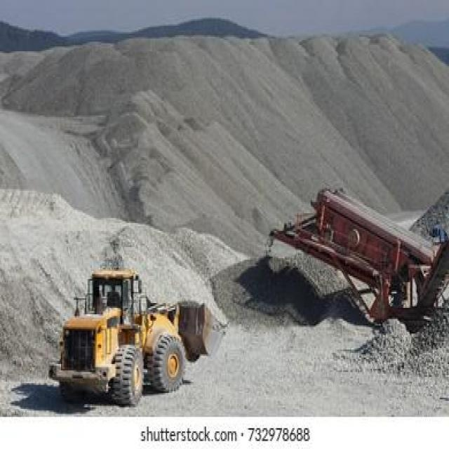
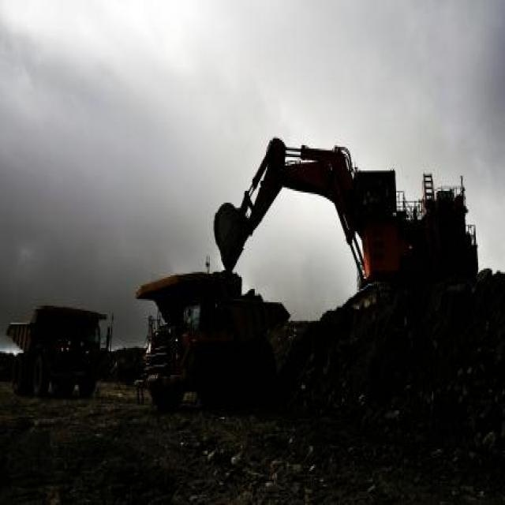

## PPE Detection on Construction Sites using YOLOv8

This project fine-tunes a **pretrained Ultralytics YOLOv8** detector to find **helmet, vest, person** in construction-site imagery. It is intentionally simple: clean dataset prep (YOLO labels), fine-tuning, evaluation, and inference on images/videos.

## Dataset (Kaggle)

We use this Kaggle dataset (YOLOv8 format, Roboflow export):

- **Construction Site Safety Image Dataset Roboflow**: `https://www.kaggle.com/datasets/snehilsanyal/construction-site-safety-image-dataset-roboflow`

It contains 10 classes; this repo **keeps only**:
- **helmet** (Hardhat)
- **vest** (Safety Vest)
- **person** (Person)

## Setup

```bash
pip install ultralytics opencv-python matplotlib
```

## Prepare dataset into the required folder structure

1) Download the Kaggle dataset zip and extract it anywhere on your machine (example: `~/Downloads/css-kaggle/`).

2) Run the prepare script (it filters/remaps labels to only helmet/vest/person and writes `dataset/data.yaml`):

```bash
python src/prepare_dataset.py --kaggle_dir ~/Downloads/css-kaggle/
```

Expected output structure (must match this exactly):

```text
dataset/
  images/
    train/
    val/
  labels/
    train/
    val/
  data.yaml
```

3) Verify the dataset:

```bash
python src/verify_dataset.py --dataset_dir dataset
```

## Train (one command)

```bash
yolo task=detect mode=train model=yolov8n.pt data=dataset/data.yaml epochs=50 imgsz=640 batch=16
```

Outputs:
- **Best weights**: `runs/detect/train/weights/best.pt`
- Metrics + plots: `runs/detect/train/`

## Evaluate

YOLO prints **Precision / Recall / mAP** during training and also writes evaluation artifacts (e.g., confusion matrix) under:
- `runs/detect/train/`

Optional explicit eval:

```bash
yolo task=detect mode=val model=runs/detect/train/weights/best.pt data=dataset/data.yaml
```

## Inference (one command)

### Images

Put a few images into `test_images/` and run:

```bash
yolo task=detect mode=predict model=runs/detect/train/weights/best.pt source=test_images/
```

### Video (optional)

```bash
yolo task=detect mode=predict model=runs/detect/train/weights/best.pt source=construction_site.mp4 save=True
```

Predictions are saved under `runs/detect/predict*/`.

## Metrics achieved (fill after training)

- **mAP@0.5**: TBD
- **Precision**: TBD
- **Recall**: TBD

## Example detections (add your outputs here)

After running inference, copy a few annotated images from `runs/detect/predict*/` into `assets/examples/` and update this section:




